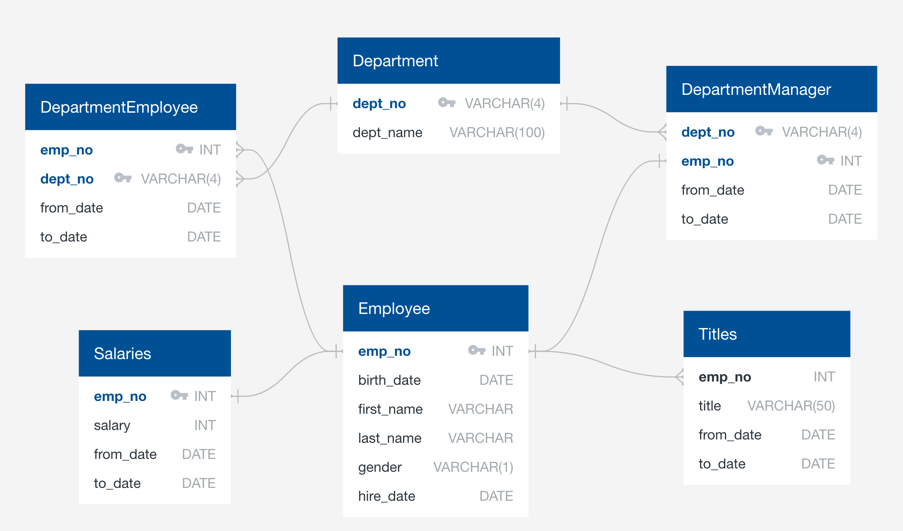
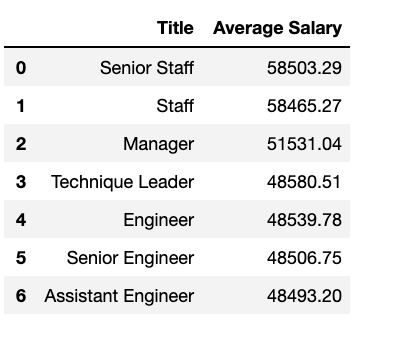
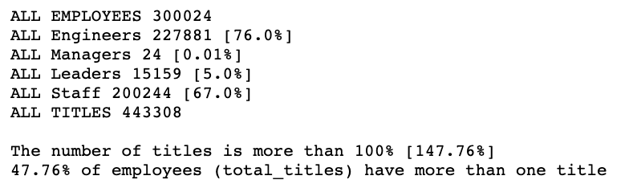

# SQL Homework - Employee Database: A Mystery in Two Parts

## Directory Structure
- EmployeeDB_ERD.png -- The Entity Relationship Diagram (ERD)
- erd.txt -- The text file to build the ERD 
- EmployeeSQL -- A directory containting the sql files and data to populate the DB
- connectingtoDB.ipynb --A jupyter notebook containing connection to the database and commands to query the DB and create plots
- images -- A directory containing images used in README.md
- README.md --this file

## Background
This assignment designs the tables to hold data in six CSV files, imports the CSVs into a SQL database, and answer questions about the data.

#### 1. Data Modeling
##### Data Inspection
After inspecting the CSV files and determining appropriate relationships bestween each of the six entities the following assumptions were made regarding the data. 
## Assumptions regarding the data
1. Each Employee has one and only one salary.
- As the number of rows is the same in both of these CSV files and using a general rule of thumb it is reasonable to conclude each employee has only one salary.
2. An employee can work across multiple Departments (e.g. Marketing and Sales)
3. An employee can have more than one title (e.g. CEO and VP of Research)
4. An employee can only manage one department, but a department can have more than one manager. 

##### Entity Relationship Diagram
After inspecting the CSV Data the next task was to sketch out an ERD of the tables. 

The following tool was used to create the ERD below [http://www.quickdatabasediagrams.com](http://www.quickdatabasediagrams.com).



#### 2. Data Engineering
A new table schema was created for each of the six CSV files. The following shows the SQL commands were used to specify data types, primary keys, foreign keys, and other constraints for *two tables* - the SQL commands to build all six tables can be found in the file _EmployeeSQL/employee.sql_.

##### DEPARTMENT TABLE
```sql
-- Department Table
-- Contains Department Number, dept_no
-- and Department Name, dept_name
-- dept_no is Primary Key
CREATE TABLE Department (
    dept_no VARCHAR(4)   NOT NULL,
    dept_name VARCHAR(100)   NOT NULL,
    CONSTRAINT pk_Department PRIMARY KEY (dept_no)
);
```

##### EMPLOYEE TABLE
```sql
-- DepartmentManager Table
-- Contains Department Number, dept_no
-- Employee Number, emp_no
-- Employee birth date, birth_date
-- Employee first name, first_name
-- Employee last name, last_name
-- Employee gender, gender
-- Hire date, hire_date
-- (emp_no)is Primary Key
CREATE TABLE Employee (
    emp_no INT   NOT NULL,
    birth_date DATE   NOT NULL,
    first_name VARCHAR   NOT NULL,
    last_name VARCHAR   NOT NULL,
    gender VARCHAR(1)   NOT NULL,
    hire_date DATE   NOT NULL,
    CONSTRAINT pk_Employee PRIMARY KEY (emp_no)
);
```

##### CONSTRAINTS
The following constraints were aded to establish FOREIGN KEYS and _Referential Integrity_ of the Database. 
```sql
ALTER TABLE DepartmentManager ADD CONSTRAINT fk_DepartmentManager_dept_no FOREIGN KEY(dept_no)
REFERENCES Department (dept_no);

ALTER TABLE DepartmentManager ADD CONSTRAINT fk_DepartmentManager_emp_no FOREIGN KEY(emp_no)
REFERENCES Employee (emp_no);

ALTER TABLE DepartmentEmployee ADD CONSTRAINT fk_DepartmentEmployee_emp_no FOREIGN KEY(emp_no)
REFERENCES Employee (emp_no);

ALTER TABLE DepartmentEmployee ADD CONSTRAINT fk_DepartmentEmployee_dept_no FOREIGN KEY(dept_no)
REFERENCES Department (dept_no);

ALTER TABLE Salaries ADD CONSTRAINT fk_Salaries_emp_no FOREIGN KEY(emp_no)
REFERENCES Employee (emp_no);

ALTER TABLE Titles ADD CONSTRAINT fk_Titles_emp_no FOREIGN KEY(emp_no)
REFERENCES Employee (emp_no);
```

Each CSV file was then imported into the corresponding SQL table to populate the tables. 

#### 3. Data Analysis
SQL code for the following queries are in in the file EmployeeSQL/employee.sql  - the first five records returned are shown here.  NOTE: Where appropriate the results were ordered. 

1. List the following details of each employee: employee number, last name, first name, gender, and salary.


2. List employees who were hired in 1986.


3. List the manager of each department with the following information: department number, department name, the manager's employee number, last name, first name, and start and end employment dates.


4. List the department of each employee with the following information: employee number, last name, first name, and department name.


5. List all employees whose first name is "Hercules" and last names begin with "B."


6. List all employees in the Sales department, including their employee number, last name, first name, and department name.


7. List all employees in the Sales and Development departments, including their employee number, last name, first name, and department name.


8. In descending order, list the frequency count of employee last names, i.e., how many employees share each last name.


## Bonus (Optional)
The data appears artificial so the further analysis was necessary

1. The SQL database was imported the into Pandas using SQLAlchemy to create and connect an engine. 

   ```sql
   from sqlalchemy import create_engine
   engine = create_engine('postgresql://localhost:5432/<your_db_name>')
   connection = engine.connect()
   ```

2. Create a histogram to visualize the most common salary ranges for employees.
##### HISTOGRAM SHOWING SALARY RANGES


##### SALARY RANGES ANALYSIS
The seems to be some anomolies in the expected salaries.  Upon inpecting the graph it can be seen that 
salaries are very heavily skewed to the lower end of the salary range
- This is especially concerning as engineers (of all ranks) comprise 50% of the total employees
- A very small proportion, less than 2% of all employees earn in excess of 95K USD
- Most employees earn in the range of 40K to 55K (approximately 61%) with even more in the 40K to 75K range (approximately 75%) 
- In general one would expect this curve to have a normal distriubtion with very few employees on the very lower range of the scale and very few on the very upper range of the scale and most of the employees in the middle.  This data is definitley skewed to the lower range of the data scale. 


3. Create a bar chart of average salary by title.
##### BAR CHART SHOWING SALARY BY TITLE 


#### SALARY BY TITLE ANALYSIS
There appears to be something awry with this data - it is peculiar that

1. Engineers are paid less than staff
2. Managers are paid less than staff
3. There is little to no difference between the salaries of an Engineer regardles of rank
- A Senior Engineer, Engineer and Assistant Engineer are all paid approximately the same salary
4 Even on the staff end Senior Staff and Staff average the same salary (almost exactly the same average)
6. Technique leaders make less than regular staff



A careful count of employees against titles shows that almost 50% of employees have more than one title (see image below). Upon further inspection the titles table is populated with many duplicates - it is apparent that as an employee changes title the database entry with their former title persists in the database. This could be why the data appears to be skewed and salaries are unevenly distributed, however the salary information remains the same as even that their former title that is the salary they earned. So there is still much disparity among salaries, and the data may be outdated.  It also indicates that there is no significant increase in pay (pay raise) with advancement to a higher level within the same title.




## Epilogue
Suspecting the data is artifical the visualization is presented to the boss, who tells you to search your ID number (49942) 

Upon searching the employeed ID number 499942 it is revealed that the entire process was an *APRIL FOOLS* prank.  This explains the salary distribution. 


### Copyright

Ann McNamara © 2020. All Rights Reserved.
